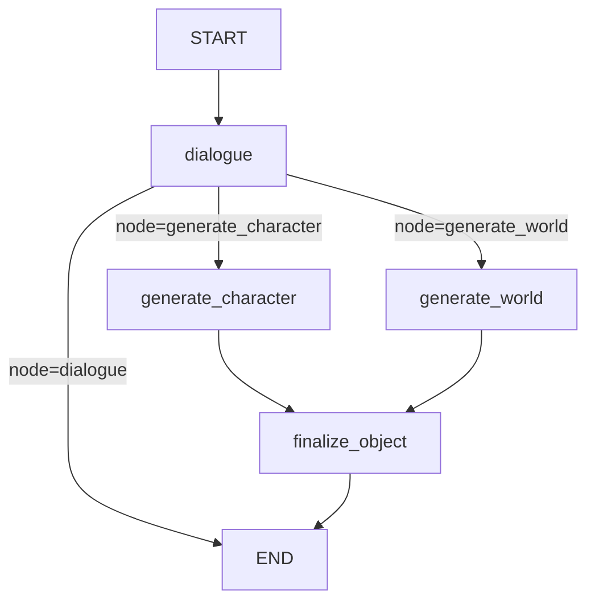
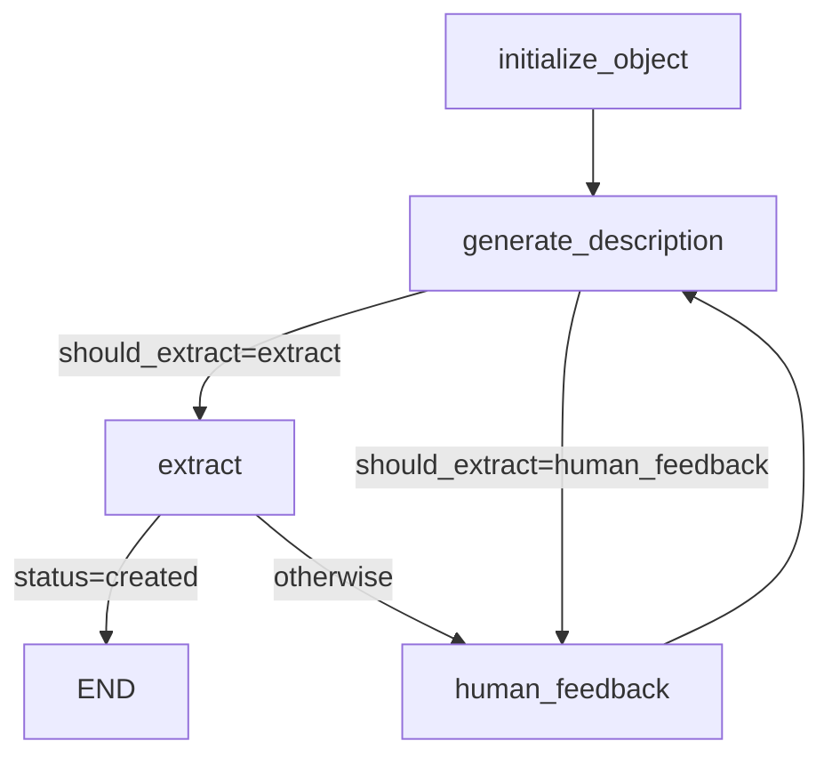

# storyteLLer

Lightweight LangGraph-based storytelling assistant

## Run

- Install dependencies and set environment variables (for example in `.env`).
- Start the CLI:
  - `python -m app.main`
  - `python -m app.main --user-id user123`

## Current Pipeline Schema

### Top-Level Graph (`StorytellerState`)

Routing is controlled by structured JSON from `dialogue`:
- `{"node":"generate_character","response":"..."}`
- `{"node":"generate_world","response":"..."}`
- `{"node":"dialogue","response":"..."}`

### Generator Subgraph (used by character/world nodes)

