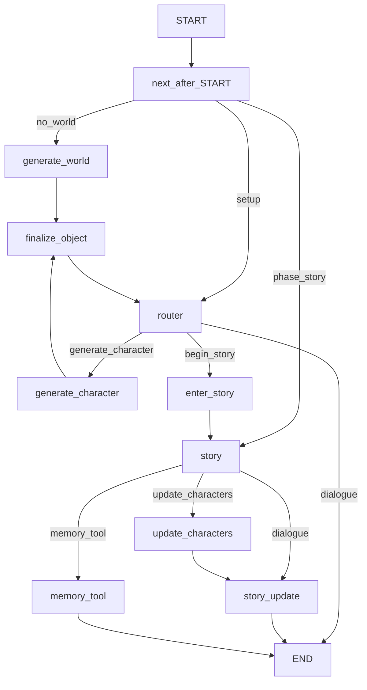
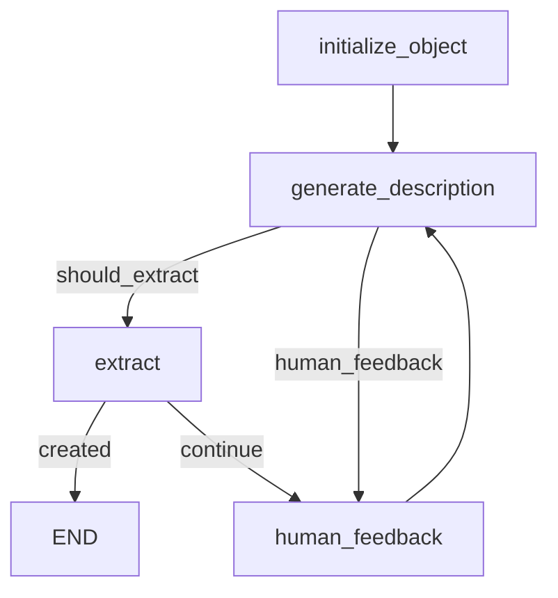

# storyteLLer

Lightweight LangGraph-based storytelling assistant: build a **world**, add **characters**, then run the **story** with rolling memory, in-story character updates, and optional memory lookup.

## Run

Install dependencies and set environment variables (for example in `.env`).

**CLI**

```bash
python -m app.main
python -m app.main --user-id user123
```

**Streamlit UI**

```bash
streamlit run app/ui.py
```

The UI shows the current phase, world, characters, rolling summary, and event log in the sidebar. World creation starts automatically on first load (same bootstrap as the CLI).

Configuration lives in `[app/config/default.yaml](app/config/default.yaml)` (override with `APP_CONFIG_PATH`). Key sections: `router` (setup phase), `story_narrator` (narrator routing), `story_update` (rolling summary), `agents` (world/character generators), `memory_agent`.

## Pipeline overview

1. **World (once)** — Until `story.world` is set, each new user turn starts at `generate_world`.
2. **Setup router** — With a world in place, `router` handles chat and may route to `generate_character` or `begin_story` when the user wants to start the narrative.
3. **Story** — After `enter_story`, `phase` is `story`. Each turn goes to the `story` narrator, which may route to:
  - `**dialogue`** — normal narrative; then `story_update` runs before the turn ends.
  - `**update_characters**` — patch a character whose state changed (inventory, relationships, etc.); then `story_update`.
  - `**memory_tool**` — list or fetch world/character/event data; ends the turn without `story_update`.

`finalize_object` merges finished `WorldObject` / `CharacterObject` into `[Story](app/state/schemas.py)` (`story` + `phase` on `StorytellerState`).

## Memory

Two layers:


| Layer               | Where                  | What                                                                                              |
| ------------------- | ---------------------- | ------------------------------------------------------------------------------------------------- |
| **Story aggregate** | `Story` in graph state | `world`, `characters`, `summary`, `events`                                                        |
| **Store**           | `InMemoryStore`        | `(user_id, "memories")` — world/character objects; `(user_id, "events")` — per-turn event records |


After each narrative turn, `story_update` refreshes `Story.summary`, appends a `StoryEvent`, and writes the event to the store. The narrator can call `memory_tool` proactively to recall past events or character details not in context.

During story play, `update_characters` uses the same trustcall extraction pattern as setup to patch character fields in place.

## Top-level graph (`StorytellerState`)




## Character / world subgraph (`ObjectGenerator`)


