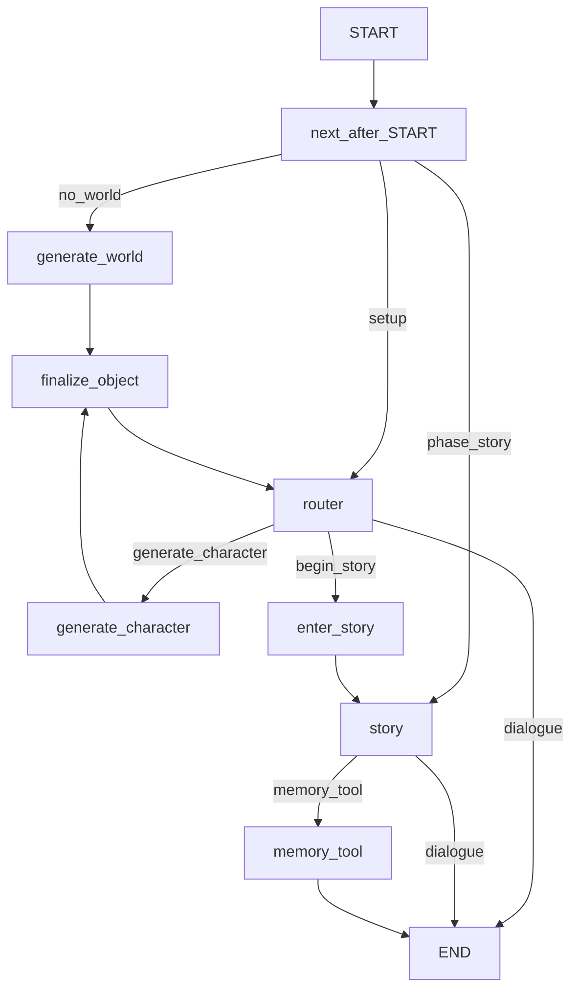
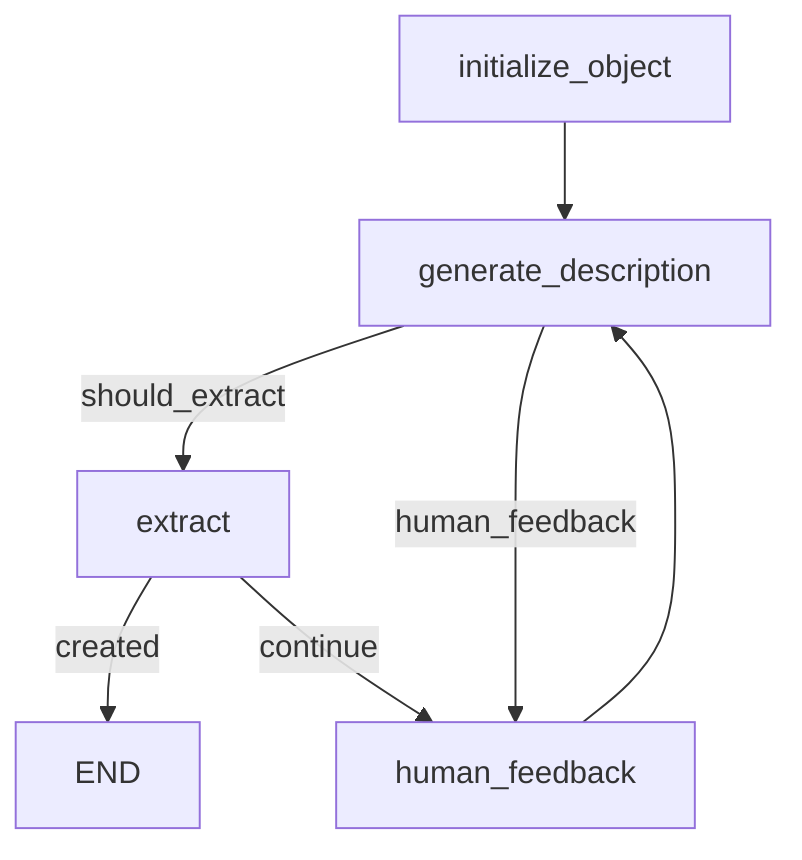

# storyteLLer

Lightweight LangGraph-based storytelling assistant: build a **world**, add **characters**, then run the **story** with an optional **memory** tool for listing or fetching world/character data from the in-session `Story` aggregate.

## Run

- Install dependencies and set environment variables (for example in `.env`).
- Start the CLI:
  - `python -m app.main`
  - `python -m app.main --user-id user123`

Configuration lives in [`app/config/default.yaml`](app/config/default.yaml) (override with `APP_CONFIG_PATH`). Key sections: `router` (setup-phase prompts), `story_narrator` (narrator + routing), `agents` (world/character object generators), `memory_agent`.

## Pipeline overview

1. **World (once)** — Until `story.world` is set, each new user turn starts at `generate_world` (object subgraph). The router never starts a second world.
2. **Setup router** — With a world in place, `router` handles chat and may route to `generate_character` or to `begin_story` when the user wants to start the narrative.
3. **Story** — After `enter_story`, `phase` is `story`; turns go to the `story` node (narrator). The model may route to `memory_tool` for list/get requests; that subgraph ends the turn (`memory_tool` → `END`) so the memory reply stays visible; the next message starts again at `START` → `story`.

`finalize_object` merges finished `WorldObject` / `CharacterObject` into [`Story`](app/state/schemas.py) (`story` + `phase` on `StorytellerState`).

## Top-level graph (`StorytellerState`)

## Character / world subgraph (`ObjectGenerator`)

The interactive CLI ([`app/main.py`](app/main.py)) sends one synthetic bootstrap user line after the welcome so the first model turn runs without waiting for typed input. Further turns use your real messages.

`human_feedback` uses LangGraph `interrupt()` so the CLI can pause for input. The payload is `{"draft","hint"}` (`draft` = last assistant line when present). **`tell()` only surfaces `draft` to the user**—the English `hint` is not printed (the startup message explains the flow). `tell()` chooses **resume** vs **new message** using the checkpoint (`aget_state` / `interrupts`), not only an in-memory flag, so normal story lines are not mis-sent as `Command(resume)` into this subgraph.
