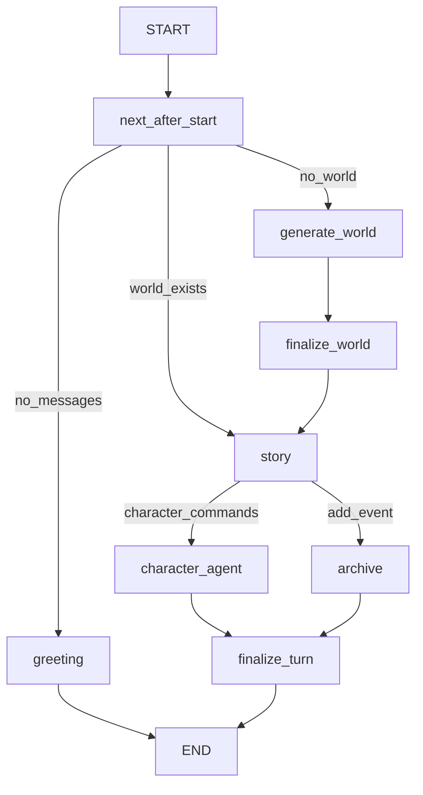
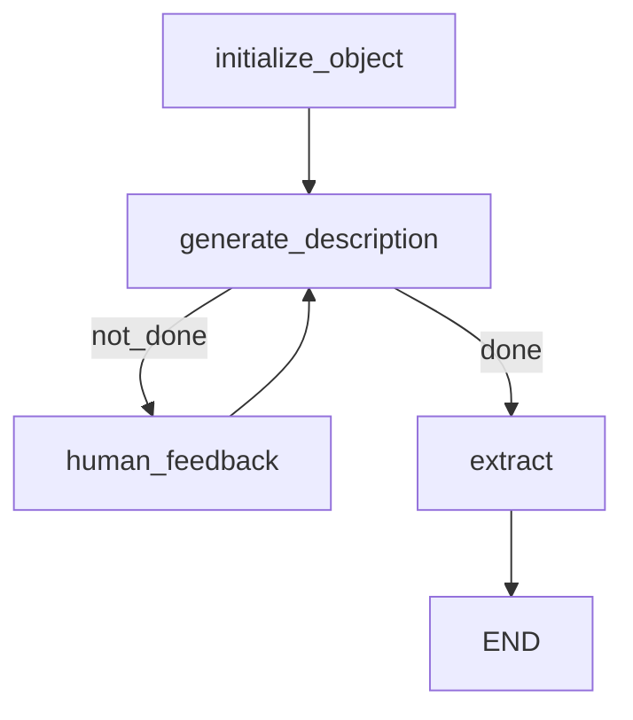

# StoryteLLer


Lightweight LangGraph-based storytelling assistant: build a **world**, then run the **story** with rolling memory. Characters are created and updated on the fly, the moment they're mentioned.

## Highlights

- **Multi-agent LangGraph architecture** — a top-level graph with a story narrator, character agent, and `story_update` archivist, driven by structured JSON routing decisions.
- **Human-in-the-loop world generation** — world creation runs as a reusable subgraph (`ObjectGenerator`) that iterates on user feedback and extracts a structured Pydantic object via [trustcall](https://github.com/hinthornw/trustcall) JSON-patching.
- **On-demand character agent** — characters are created and patched in the background (trustcall extraction, no interactive wizard) whenever the narrator mentions a new or changed character; the model itself resolves which character each mention refers to, using the full character list.
- **Rolling story memory** — a `Story` aggregate in graph state (world, characters, rolling summary, events) that the narrator sees each turn and that is saved to disk.
- **Dual interfaces** — an interactive CLI and a Streamlit chat UI, both with auto-save/load persistence.
- **Provider-agnostic LLM setup** — works with any OpenAI-compatible endpoint (Groq, OpenAI, local servers) via a single YAML config.

## Setup

Requires Python 3.12+. With [uv](https://docs.astral.sh/uv/) (recommended):

```bash
uv sync
```

Or with pip:

```bash
pip install -e .
```

Copy [`.env.example`](.env.example) to `.env` and add your API key:

```env
OPENAI_API_KEY=your_key_here
```

The default config points at Groq's OpenAI-compatible API (`openai/gpt-oss-120b`). Any OpenAI-compatible provider works — edit the `llm` section (`model`, `base_url`) in [`app/config/default.yaml`](app/config/default.yaml) and set `OPENAI_API_KEY` to that provider's key.

Configuration lives in [`app/config/default.yaml`](app/config/default.yaml). Override the path with `APP_CONFIG_PATH`. Key sections: `llm`, `story_narrator`, `story_update`, `agents`, `saves_dir`.

## Run

**CLI**

```bash
python -m app.main
python -m app.main --user-id user123
```

Type `/load` to pick a saved world and resume. Type `exit`, `quit`, or `done` to finish.

**Streamlit UI**

```bash
streamlit run app/ui.py
```

The sidebar shows phase, world, characters, rolling summary, and events. Actions:

- **New Story** — start a fresh session on a new thread (old saves stay on disk).
- **Load a world** — resume a saved story; chat history is restored from the save file.

World creation starts automatically on first load (same bootstrap as the CLI).

**HTTP API**

```bash
uv run uvicorn app.api:app --reload
```

A FastAPI wrapper around `Storyteller.init` / `tell` / `load`. Interactive docs are at `http://localhost:8000/docs`. An optional `X-User-Id` header selects the user (default `1`). CORS origins come from `STORYTELLER_CORS_ORIGINS` (comma-separated, default `http://localhost:5173`).

| Method | Path | Purpose |
| --- | --- | --- |
| `POST` | `/threads` | Start a thread; returns `thread_id` and the greeting |
| `POST` | `/threads/{thread_id}/turns` | Send `{"message": "..."}`; streams the turn over SSE |
| `GET` | `/threads/{thread_id}/state` | Phase, turn, story, pending prompt, chat history |
| `GET` | `/saves` | List saved stories, newest first |
| `POST` | `/saves/{story_id}/resume` | Load a save into a new thread |

A turn streams `node` events as graph steps finish, then one `message` event (`text`, `awaiting_feedback`) or an `error`, then `done`. Sending a second turn to a thread while one is running returns `409`.

```bash
curl -N -X POST localhost:8000/threads/<thread_id>/turns \
  -H "Content-Type: application/json" -d '{"message": "A foggy fishing village"}'
```

Threads live in memory and are lost on restart; saves on disk are not.

## Saves

Stories are **auto-saved** after each turn once a world exists. Files go to `saves/<story_id>.json` (configurable via `saves_dir` in config). Each file holds the full graph state: story aggregate, messages, phase, turn, and thread id.

On load, checkpoint state is rebuilt from the saved `Story`.

## Pipeline overview

1. **World (once)** — Until `story.world` is set, each new user turn starts at `generate_world`. Once finished, `finalize_world` merges the `WorldObject` into [`Story`](app/state/schemas.py) and `phase` becomes `story` — there's no separate setup phase.
2. **Story** — Every turn after that goes to the `story` narrator, which always writes a reply and may additionally flag:
   - **`character_commands`** — one plain-language line per character newly introduced or changed this turn (no ids); routes (in parallel with the below) to `character_agent`, which resolves each command in its own trustcall call against the full character list and either patches an existing character or creates a new one.
   - **`add_event`** — a key event worth archiving; routes (in parallel) to `archive`.
   - Otherwise (no character changes, no event) — falls straight through to `finalize_turn`.

`character_agent` and `archive` fan back into `finalize_turn`, which increments `turn` and merges in the summary/event.

## Memory

The `Story` aggregate on graph state holds `world`, `characters`, `summary`, and `events`. After a turn flagged with `add_event`, `archive` refreshes `Story.summary` and appends a `StoryEvent`. The narrator sees the world, the character list, the rolling summary, and recent events in its prompt each turn. The same aggregate is what gets written to the save file.

During story play, `character_agent` handles each of the narrator's plain-language commands with its own trustcall call (inserts enabled) — passing every existing character (tagged with its own id) alongside it — so the model decides, per command, whether to patch an existing character or create a new one. Processing sequentially also means a later command in the same turn can see a character a prior command in that turn just created.

## Top-level graph (`StorytellerState`)


```mermaid
flowchart TD
  START --> nextStart[next_after_start]
  nextStart -->|no_messages| greeting
  nextStart -->|no_world| generate_world
  nextStart -->|world_exists| story
  generate_world --> finalize_world
  finalize_world --> story
  greeting --> END
  story -->|character_commands| character_agent
  story -->|add_event| archive
  character_agent --> finalize_turn
  archive --> finalize_turn
  finalize_turn --> END
```

## World subgraph (`ObjectGenerator`)


```mermaid
flowchart TD
  initialize_object --> generate_description
  human_feedback --> generate_description
  generate_description -->|not_done| human_feedback
  generate_description -->|done| extract
  extract --> END
```

## Development

Install dev tools and run the test suite:

```bash
uv sync
uv run pytest
```

Formatting, linting, and tests are handled by pre-commit (black, isort, autoflake, flake8, pytest):

```bash
uv run pre-commit run --all-files
```

CI runs both on every push and pull request.

## Future ideas

- Long-term memory via the MCP memory server (`@modelcontextprotocol/server-memory`)
- Character Catalogue and Worlds Catalogue to review, update, and reuse
- Rewrite a previous message and continue the dialogue from there
- Character portrait generation from a description
- FastAPI
- Vite + TypeScript frontend alongside the CLI and Streamlit UI
